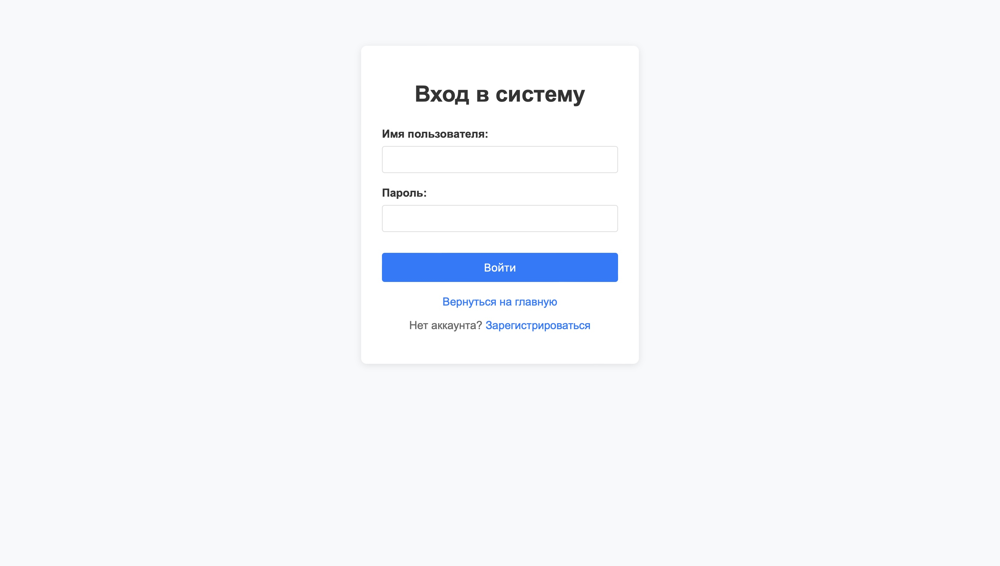
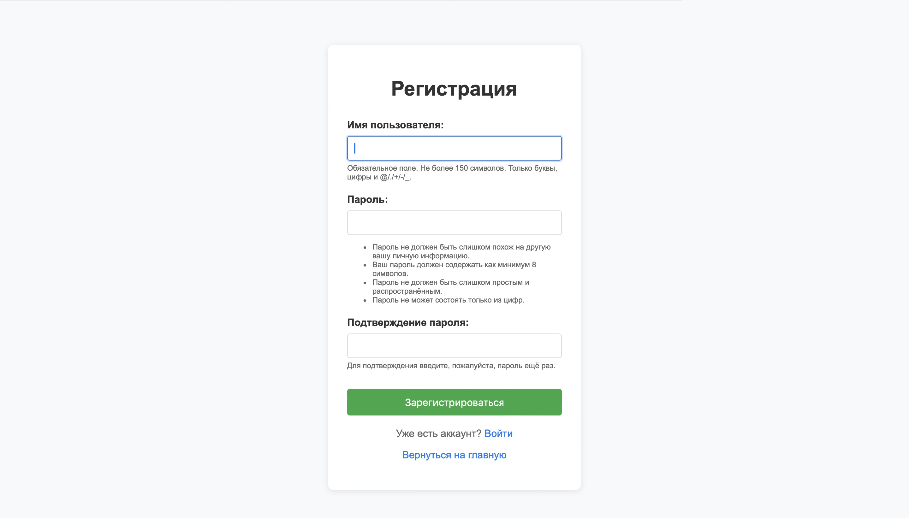
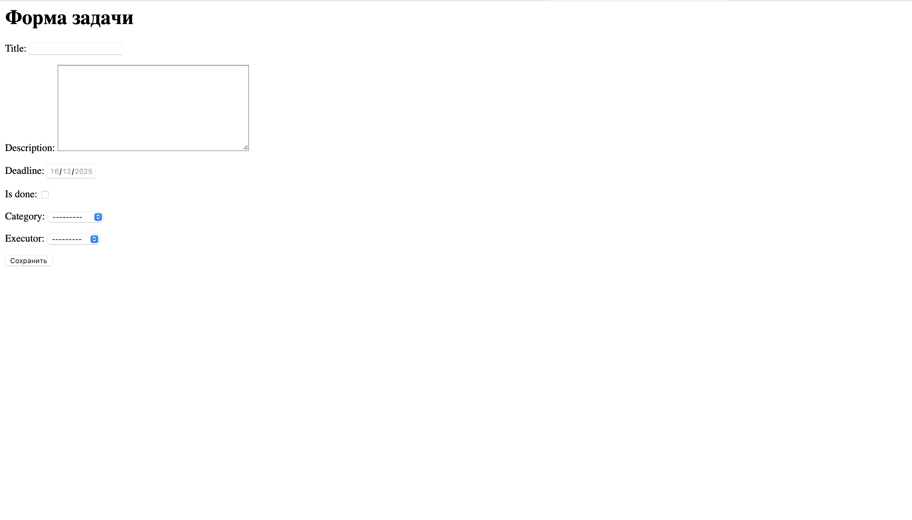
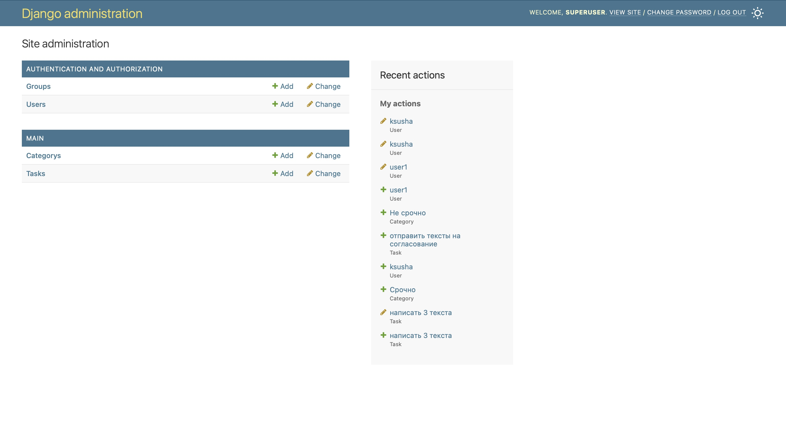
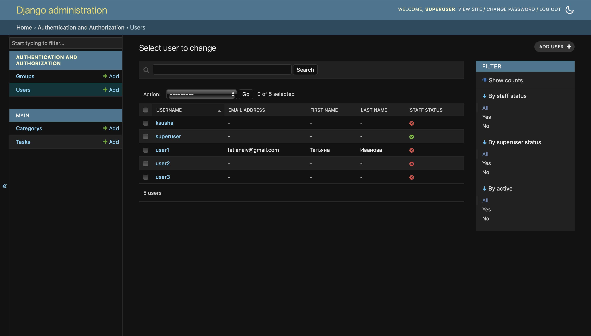

1. Запуск программы
Для того, чтобы запустить программу, необходимо в Терминале прописать следующие команды:

git clone https://github.com/prosele/django_task_manager.git

cd .../django_task_manager #Нужно перейти в каталог django_task_manager

python manage.py runserver

Открыть в браузере http://127.0.0.1:8000

После этого попадем на страницу:

2. Вверху страницы видим три ссылки "Задачи", "Вход", "Регистрация"
Задачи - список задач c возможностью создавать, редактировать, удалять задачи (доступно только для авторизованных пользователей)
Вход: 

Регистрация:

3. Возможность создать задачу
Нужно нажать на кнопку "Создать задачу", после чего появится форма создания задачи:

4. Фильтрация задач
Можно фильтровать задачи по категории и статусу, а также искать задачи по названию.

5. Режим суперюзера
В режиме суперюзера имеем такой интерфейс (можно выбрать светлую и темную тему):

Права у суперюзера: создание и изменение категорий, групп, пользователей, задач

